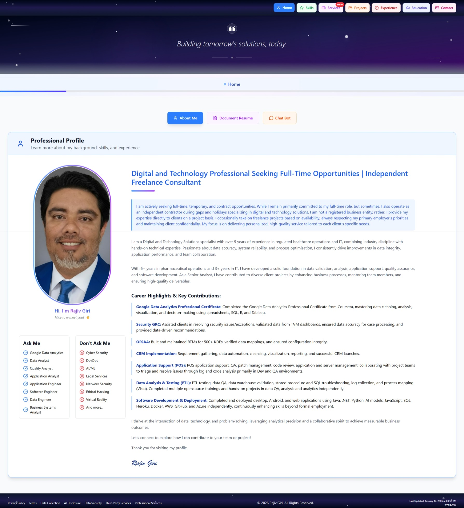

# 🚀 Portfolio Website

> A modern, responsive portfolio website showcasing Quality Assurance and Software Development Engineering in Test (SDET) skills, built with React and Tailwind CSS.

## 📖 About The Project

ConsultantPro is a comprehensive portfolio website designed for QA professionals and SDET consultants who are building their careers in software testing and automation. The website features a modern, single-page application design with smooth navigation and full-screen sections optimized for all devices.

### ✨ Key Features

- **🎨 Modern UI/UX Design** - Clean, professional interface with colorful navigation
- **📱 Fully Responsive** - Optimized for desktop, tablet, and mobile devices  
- **🔄 Single Page Application** - Smooth click-based navigation without scrolling
- **🎯 8 Comprehensive Sections** - Complete portfolio coverage from skills to contact
- **🌈 Colorful Components** - Each section has its own color theme and icons
- **📊 Interactive Elements** - Progress bars, tabs, forms, and animations
- **🚀 Fast Performance** - Optimized loading with modern React patterns
- **🔒 Secure Contact** - Protected contact information with human verification
- **📄 Legal Compliance** - Comprehensive legal policies and terms of service
- ~~🔧 Admin Panel~~ *(design cancelled due to budget and time constrain and will try to work in future if needed)*

## 🛠️ Built With

- **Frontend Framework:** [React 18](https://reactjs.org/)
- **Styling:** [Tailwind CSS](https://tailwindcss.com/)
- **Icons:** [Lucide React](https://lucide.dev/)
- **Build Tool:** [Vite](https://vitejs.dev/)
- **Language:** JavaScript (ES6+)
- **Version Control:** [GitHub](https://github.com/rajg2023/RajConsultingPortfolio)

## 🏗️ Project Structure

src/
├── components/
│ ├── Header.jsx # Navigation header with colorful buttons
│ ├── Footer.jsx # Professional footer with links
│ ├── About/
│ │ ├── AboutSection.jsx # Main about container
│ │ ├── AboutMe.jsx # Personal introduction
│ │ ├── ~~VideoResume.jsx # Video resume component~~
│ │ ├── DocumentResume.jsx # PDF resume viewer
│ │ └── AIChat.jsx # Interactive chat component
│ ├── Skills/
│ │ └── SkillsSection.jsx # Technical skills with progress bars
│ ├── Services/
│ │ └── ServicesSection.jsx # Service offerings
│ ├── Projects/
│ │ └── ProjectsSection.jsx # Portfolio projects showcase
│ ├── Experience/
│ │ └── ExperienceSection.jsx # Career timeline
│ ├── Education/
│ │ └── EducationSection.jsx # Education and training
│ ├── ~~Admin/~~
│ │ └── ~~AdminSection.jsx # Content management panel~~
│ └── Contact/
│ └── ContactSection.jsx # Contact forms and information
├── pages/
│ └── HomePage.jsx # Main page component
└── App.jsx # Root application component
├── components/ # Reusable UI components 
├── pages/ # Page components 
├── assets/ # Static assets 
└── contexts/ # React contexts

text

## 🚀 Getting Started

### Prerequisites

Make sure you have the following installed:
- **Node.js** (version 16.0 or higher)
- **npm** or **yarn** package manager

### Installation

1. **Clone the repository**
git clone https://github.com/yourusername/consultant-portfolio.git
cd consultant-portfolio

text

2. **Install dependencies**
npm install

or
yarn install

text

3. **Start the development server**
npm run dev

or
yarn dev

text

4. **Open your browser**
Navigate to `http://localhost:5173` to view the portfolio

## 📋 Portfolio Sections

### 🏠 Home/About
- **4 Interactive Tabs:** About Me, Document Resume, AI Chat
- ~~**Video Resume Tab:**~~ Removed due to technical issues
- **Professional Introduction:** Personal bio and key highlights
- **Downloadable Resume:** PDF and Word format options

### ⭐ Skills  
- **Skill Categories:** Display of lists of current and past skills
- **50+ Skills Listed:** With proficiency levels and experience years
- **Interactive Progress Bars:** Visual skill representation
- **Certification Tracking:** Highlighted certified skills

### 🛠️ Services
- **Service Areas:** Display of currrent and past services
- **Beginner-Friendly Approach:** Honest about learning journey
- **Detailed Descriptions:** What you can help with in each area

### 📁 Projects
- **Projects:** Display of current and past project samples.
- **Project Details:** Technologies used, duration, key learnings
- **GitHub Integration:** Links to code repositories

### 💼 Experience  
- **Timeline:** Display of current and past work experiences (Future, Present, Past)
- **Career Journey:** From current to transition learning to future goals
- **Transferable Skills:** Highlighting relevant experience

### 🎓 Education
- **3 Education Categories:** Display of Formal Education, IT Training, Certifications
- **Learning Outcomes:** Detailed achievements and skills gained
- **Continuous Learning:** Ongoing education and professional development

~~### ⚙️ Admin~~
- ~~**4 Admin Panels:** Profile Management, Content Management, Analytics, Settings~~
- ~~**Content Control:** Ability to update portfolio information~~
- ~~**Analytics Dashboard:** Mock statistics and performance metrics~~

### 📞 Contact
- **Contact Methods:** Display of Direct Contact, Hire, Consulting and Freelance
- **Multiple Channels:** Email, phone, social media links

## 🎨 Design Features

### Color Scheme
- **Blue:** Home/About sections
- **Green:** Skills and automation-related content
- **Purple:** Services and data analytics
- **Orange:** Projects and creative content
- **Red:** Experience and timeline
- **Indigo:** Education and learning
- **Gray:** Admin and technical sections
- **Pink:** Contact and communication

### Mobile Experience
- **Cool Slide-out Menu:** Animated mobile navigation
- **Touch-Optimized:** Large buttons and touch targets
- **Responsive Layout:** Adapts to all screen sizes
- **Professional Animations:** Smooth transitions and effects

## 🔧 Customization

### Personal Information
1. Update personal details in each component
2. Replace placeholder text with your own content
3. Add your own project screenshots and descriptions
4. Update contact information and social media links

### Content Management
- Use the **Admin section** to manage content
- Update skills and proficiency levels
- Add new projects and experiences
- Modify service offerings

### Styling
- Colors can be customized in each component
- Tailwind CSS classes can be modified
- Icons can be changed using Lucide React

## 📈 Performance

- **Fast Loading:** Optimized component structure
- **Mobile-First:** Responsive design principles
- **Modern React:** Hooks and functional components
- **Clean Code:** Modular architecture for maintainability

## 📋 Project Status

- **✅ Completed Features:**
  - Responsive portfolio layout
  - Skills visualization
  - Project showcase
  - Contact form with verification
  - Legal documentation
  - Professional services policy

- **⏳ Future Improvements:**
  - ~~🔧 Admin Panel~~ *(Design cancelled due to budget and time constraints - may be implemented in the future if needed)*
  - Blog section for technical articles
  - Dark/light mode toggle
  - Performance optimizations

## 🤝 Contributing

Contributions are welcome! If you have suggestions for improvements:

1. Fork the project
2. Create a feature branch (`git checkout -b feature/AmazingFeature`)
3. Commit your changes (`git commit -m 'Add some AmazingFeature'`)
4. Push to the branch (`git push origin feature/AmazingFeature`)
5. Open a Pull Request

## 📄 License

Distributed under the MIT License. See `LICENSE` for more information.

## 📝 Legal

- [Privacy Policy](/legal/privacy)
- [Terms of Service](/legal/terms)
- [Professional Services Policy](/legal/professionalServicesPolicy)
- [Third-Party Services](/legal/thirdParty)

## 📞 Contact

**Name** - Your Name

- **Email:** youremail.domain
- **Phone:** (###)###-####.
- **LinkedIn:** [linkedin.com/in/yourusername](https://linkedin.com/in/yourusername)
- **GitHub:** [github.com/yourusername](https://github.com/yourusername)

**Project Link:** [https://github.com/yourusername/consultant-portfolio](https://github.com/yourusername/consultant-portfolio)

## 🙏 Acknowledgments

- [React](https://reactjs.org/) - Frontend framework
- [Tailwind CSS](https://tailwindcss.com/) - Styling framework  
- [Lucide React](https://lucide.dev/) - Icon library
- [Vite](https://vitejs.dev/) - Build tool and dev server

---

